## README Gene

This project was for my UCSD coding bootcamp, creating a README.md generator.  

# Demo Video & Repository

* [GitHub Repo](https://github.com/latommyla/README-Gene)

https://user-images.githubusercontent.com/85325106/142712138-719c9425-0994-41ab-bfe3-450f684eddb6.mp4

# Description

Devloping a README.md generator that has prompts asking for the title, description, installation instructions, usage information, contribution guidelines, and testing instructions. 

# What was used in this project?

- JS
- Node JS

# Feature

- Two JS Pages - index.js & generateMarkdown.js
- Two JSON Pages - package.json & package-lock.json

# Installation

To install this project, simply download the zip file or clone the SSH key to your terminal. GitHub has instructions on how to do this. Also will need to install NODE.js in order to run build fucntions within your terminal.

# How it works?

- In your Terminal, input "node index.js" and you will be prompted to choose a license from a list.

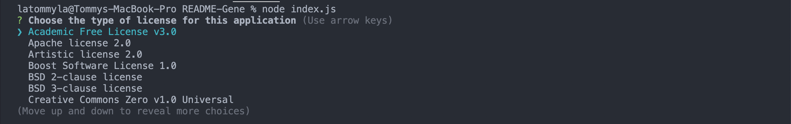

- Then you will be asked for the title of your README file.

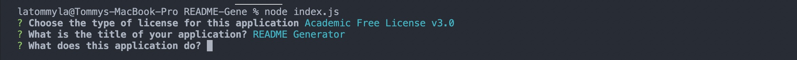

- What does this application do?

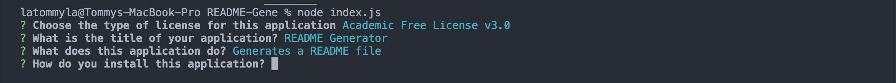

- How do you install this application?

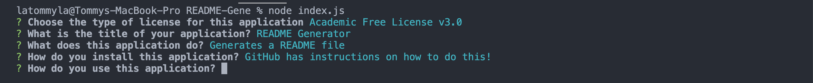

- How do you use this application?

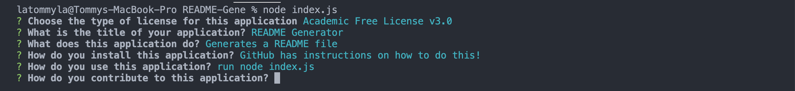

- How do you contribute to this application?

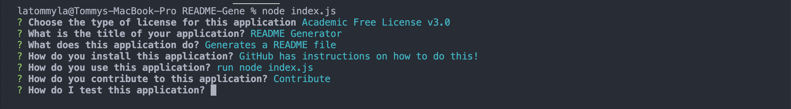

- How do you test the application?

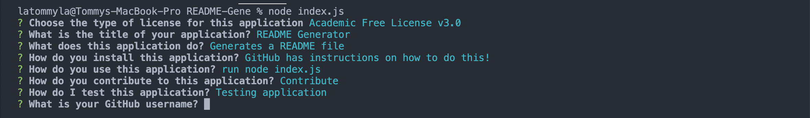

- What is your GitHub username?

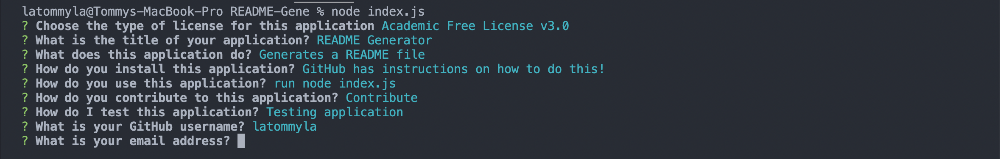

- What is your email address?

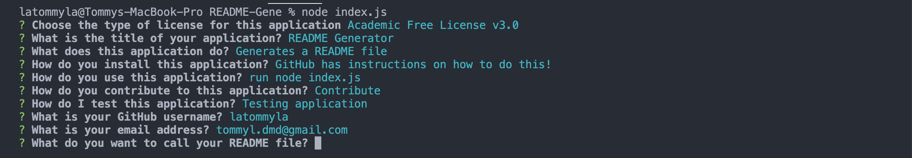

- What do you want to call your README file?

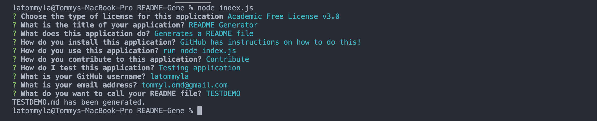

- You then will be presented with your new README file!

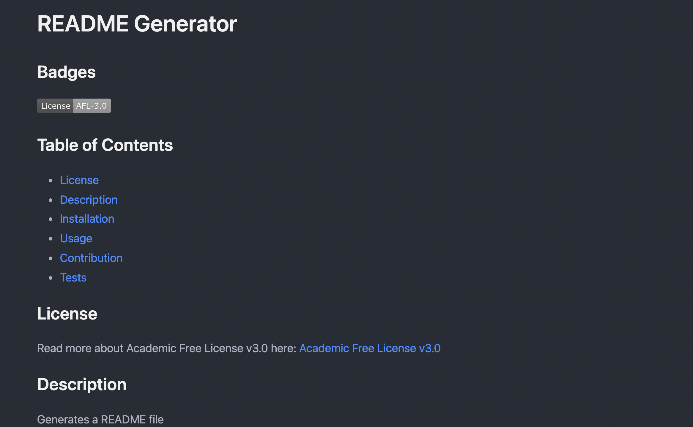

# Contact

* [My Gmail](mailto:tommyl.dmd@gmail.com)
* [GitHub](https://github.com/latommyla)
* [Instagram](https://instagram.com/latommyla)
